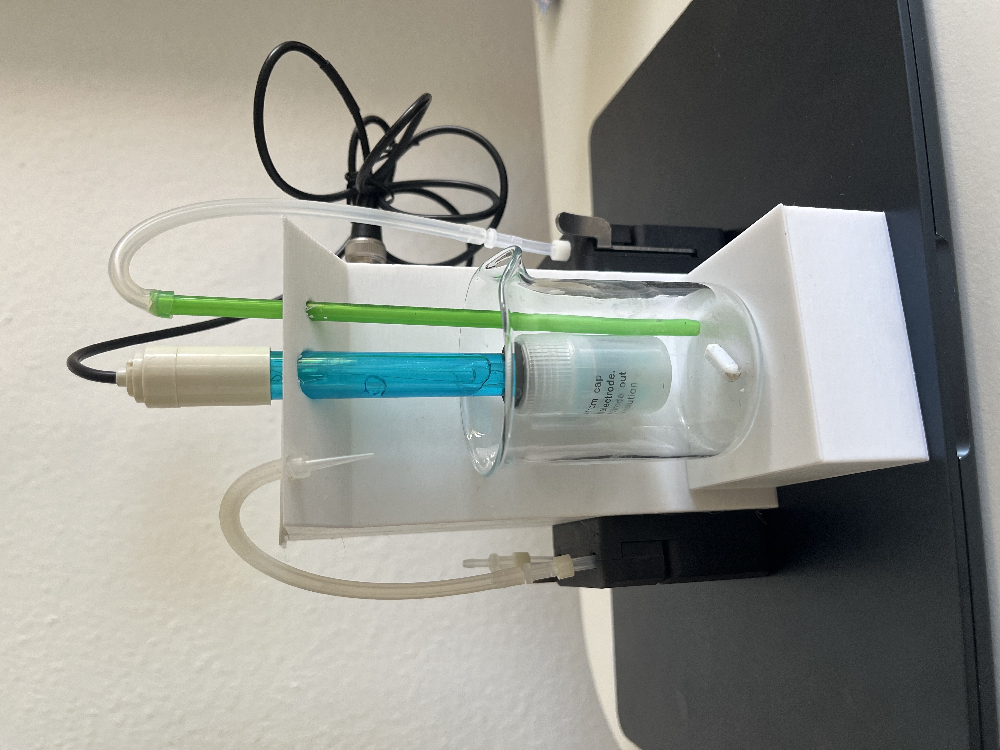
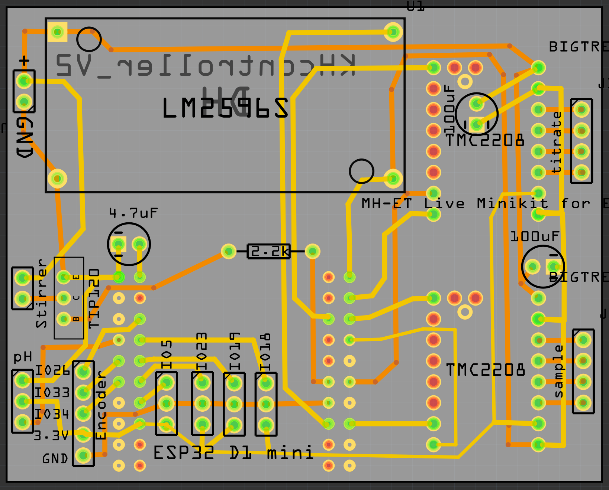

# KHcontroller_V3



## Introduction
This is my version of a DIY KH measurement device for my reef tank. It is built from standard, easy to acquire parts and proved for me to be very robust and accurate using it the last years. I did this project initially without thinking about shaing, so the software side is not plug and play. I am happy if somebody wants to contriubute to make it easier also for people who do not have much experience with software development.

The device is controlled by an ESP32 module and a custom-designed PCB that connects the ESP32, the pH meter, stepper motors, and stirrer and all the peripherals. The principle is simple: HCl is titrated into the water sample, and the volume needed to reach a pH of 4.5 is used as the basis for calculating alkalinity. When I built the first prototype, I made an explanatory video (in English):
https://youtu.be/9Bjq2lXnfBI?si=s0VGVHdJ8H3_aLlS

To achieve higher accuracy and reliability, I use 0.012 molar HCl, commercial devices usually use higher molarity. Why exactly 0.012? - Because that's 5 ml of 37% HCl in 5 L of reverse osmosis water, and it's easy to prepare.

In my case, the device is controlled and the data visualized on a Raspberry Pi Node-RED dashboard, but you can build your own solution. The data is transmitted via MQTT.

Why is this device so accurate/reliable? Things I've tested over time that make a big difference in accuracy:
- Low acid concentration: the lower the concentration, the smaller the effect of errors during titration (e.g., air bubbles).
- Titration with "pressure" to titrate small volumes, enabling titration of volumes smaller than a drop.
- Firmware optimization of the titration process (more measurement points and longer stirring as you get closer to 4.5).
These points ensure that even a cheap pH probe is sufficient to get accurate results.

## BOM

- 1x Wemos D1 mini ESP32
- 1x DF-Robot pH-Meter V2
- 2x Nema 17 stepper motor  42Ncm 1,5A 42x42x38mm
- JST-XH 2-, 3- and 4-pin
- 1x LM2596S, set to 5V output
- 2x TMC2208 drivers
- 1x TIP120
- 1x 2,2 K resistor
- 2x 100uF capacitor
- 1x 4,7 uF capacitor
- 2x Nema 17 perestaltic pumps
- 1x 100 ml Beaker
- Silicone tube 2/4 or 4/6
- 1x 60mm PC cooling fan
- 1x magnetic stirrer ca 1cm length
- 2x flat magnets, ca. 1 cm length, 2mm height
- 1x 12V Powersupply > 2A
- 0.02M HCl


## PCB Layout

The PCB is designed as follows:



You can use the gerber file shared here to order your own PCB. I indicated on the PCB which components to solder where.
There are quite some unused interfaces to allow for extension of the functionality with e.g. temperature sensors or dosing pumps. The required interfaces are labelled (except for the encoder one, this one is not necessary for function)

## Firmware

You can upload the firmware using the PlatformIO extension in Visual Studio Code. OTA firmware updates are enabled.
Make sure to add your WIFI SSID, password and the mqtt broker IP in the main.cpp src/main.cpp file.

## MQTT channels

- KHcontrollerV3/message -> any messages of the device
- KHcontrollerV3/error -> channel to post errors
- KHcontrollerV3/mes_pH -> channel where current pH during titration is published
- KHcontrollerV3/KH -> publishes the number of drops used for titration
- KHcontrollerV3/startPH -> publishes the pH at start of titration
- KHcontrollerV3/output -> channel where commands to the controller can be published

## Commands

Commands can be given to the device via mqtt (output channel) or via the serial interface
- Measure KH: k
- measure pH: p
- fill titration tube: f
- measure sample volume: s
- measure titration volume: t
- start stirrer: m
- end stirrer: e
- remove sample: r
- reset: o
- calibrate pH4: 4
- calibrate pH7: 7
- measure pH probe voltage: v


## calculating KH

KH [dKH] = (drops / 6000) * titration volume / sample Volume * 2800 * conc HCL * correction factor

- Titration and sample volume are measured when using the t and s commands, measure the volumes as accurately as possible to get accurate results.
- Standard HCl concentration is 0.02M which equates to 10 ml 37% HCl in 5 L water (first Water then acid!). This for me is the best balance between accuracy/reproducibility and reasonable volumes to handle.


## Installing and setting up Mosquitto
On your Raspberry pi run on the command line:

```
sudo apt update && sudo apt upgrade
sudo apt install -y mosquitto mosquitto-clients
sudo systemctl enable mosquitto.service
```

Open:
```
sudo nano /etc/mosquitto/mosquitto.conf
```

At the top of the file paste:
```
per_listener_settings false
```

And paste at the end of the file:
```
listener 1883
allow_anonymous true
password_file /etc/mosquitto/passwd
```
Then, press CTRL-X to exit and save the file. Press Y and Enter.
 
Restart Mosquitto for the changes to take effect:
```
sudo systemctl restart mosquitto
```


## Node Red Dashboard

I use Node Red to manage the workflows and as dashboard. You can use my backuped workflow. Just make sure to change this to the IP of your mqtt broker in the file:
"broker": "homeserver.local"